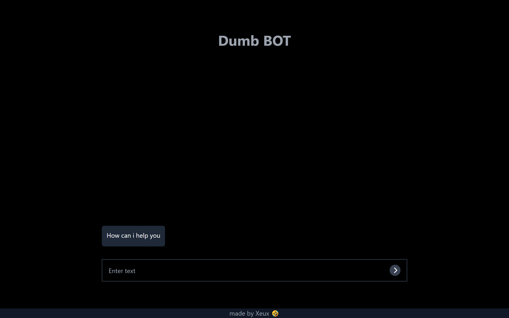

# Chat Bot

This is a Personalised Chat Bot which does not include an AI but complex query of stored question types and answers that accurately queries the closest match to a question and provides the desired answer to a specific need of your clients.

## Table of contents

- [Overview](#overview)
  - [Screenshot](#screenshot)
  - [Links](#links)
- [My process](#my-process)
  - [Built with](#built-with)
  - [What I learned](#what-i-learned)
  - [Continued development](#continued-development)
- [Author](#author)

## Overview

### Screenshot

### Links

- Solution URL: [click here](https://github.com/Headbwoi/chat-bot)
- Live Site URL: [click here](https://dumb-chatbot.vercel.app/)

## My process

### Built with

#### Frontend

- [React](https://reactjs.org/) - JS library
- [TailwindCSS](https://tailwindcss.com)
- [TypeScript](https://www.typescriptlang.org/)
- [Vite](https://vitejs.dev/)

#### Backend

- [TypeScript](https://www.typescriptlang.org/)
- [Express.js](https://expressjs.com/)
- [Nodejs](https://nodejs.org/)
- [MongoDB](https://www.mongodb.com/)
- [Mongoose](https://mongoosejs.com/)
- [Dotenv](https://www.npmjs.com/package/dotenv)
- [CORS](https://www.npmjs.com/package/cors)
- [Nodemon](https://nodemon.io/)
- [Concurrently](https://www.npmjs.com/package/concurrently)

### What I learned

- I learned how to build an app using the **MERN** stack using the popular **MVC Architecture**.
- The main challenge was the backend as i opt to use TypeScript for Both Frontend and Backend. I struggled with the configurations but i figured it out.
The upside is the Type Safety it provides and the DX was nothing short of awesome.
- On the other hand, The Frontend was rather enjoyable to work on.
I used the native **Context API** of [React](https://reactjs.org/) to manage the state and handle interactivity across nested components.

### Continued development

- Improve UI to be more interactive.
- Make the user dynamically set the questions and answers and integrate with their Web APP.
- Make the app a PWA that is installable.

## Author

- Website - [Headbwoi](https://xeuxdev.vercel.app)
- Twitter - [@Headbwoi_1](https://www.twitter.com/Headbwoi_1)
